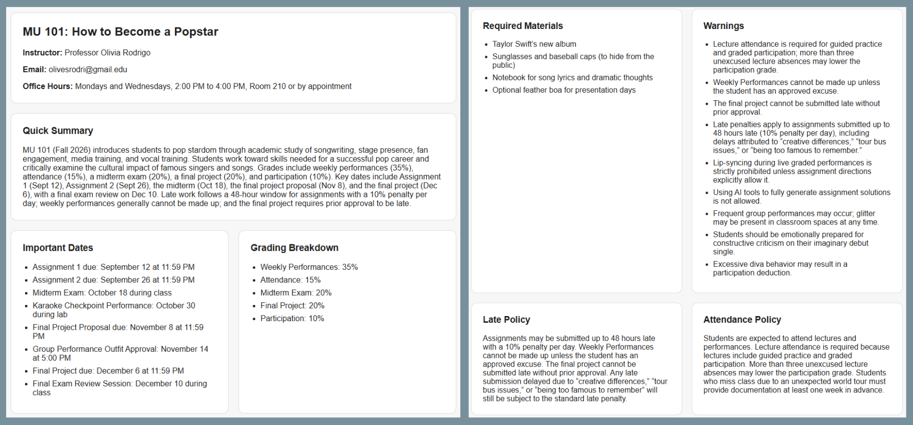

# AI Syllabus Helper

AI Syllabus Helper is a full-stack web app that helps students quickly understand a course syllabus. Users can either upload a PDF/TXT file or paste text directly.

## Features

- Upload a PDF, TXT, or MD syllabus file
- Paste syllabus text manually
- Extract course name, instructor, email, office hours, grading breakdown, important dates, policies, and required materials
- Generate a simple AI-powered summary
- Display warnings for important rules like strict attendance or late penalties
- Loading and error states
- Secure API key handling with environment variables

## Tech Stack

Frontend:
- React
- TypeScript
- Vite
- CSS

Backend:
- Python
- FastAPI
- Pydantic
- pypdf
- OpenAI API

## Screenshots

### Upload or Paste Syllabus


### AI Summary Output



## How It Works

1. The user uploads a syllabus file or pastes syllabus text.
2. The React frontend sends the input to the FastAPI backend.
3. If the user uploads a PDF, the backend extracts embedded text using pypdf.
4. The backend sends the syllabus text to the OpenAI API.
5. The AI returns structured syllabus information.
6. FastAPI validates the response and sends JSON back to React.
7. React displays the results in organized summary cards.

## Running Locally

### Backend

```bash
cd backend
python -m venv venv
venv\Scripts\activate
pip install -r requirements.txt
uvicorn main:app --reload --port 8000
```

Create a `.env` file inside the `backend` folder:

```bash
OPENAI_API_KEY=your_api_key_here
```

### Frontend

```bash
cd frontend
npm install
npm run dev
```

The frontend runs at:

```txt
http://localhost:5173/
```

The backend runs at:

```txt
http://localhost:8000/
```

## Limitations

- Scanned PDFs are not supported yet because the app currently extracts embedded PDF text, not image-based text.
- The app currently runs locally and is not deployed.
- Calendar export and syllabus Q&A are planned future features.

## Future Improvements

- Add drag-and-drop file upload
- Add syllabus question-answering
- Add Google Calendar export for deadlines
- Support scanned PDFs with OCR
- Deploy the frontend and backend online